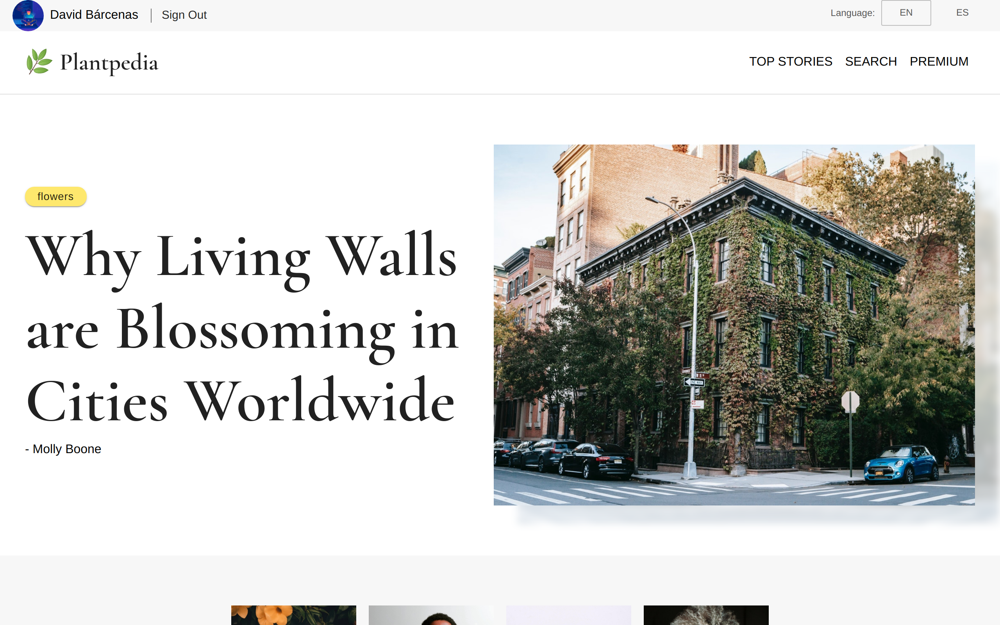

  

***

Next.js saga project where a static plant site was developed, with more than 400 entries in Contentful CMS to better understand the development of a real site and apply professional strategies.

  🐞 <a href="https://github.com/DavidBarcenas/nextjs-plantpedia/issues">Report a Bug</a> 
  🙋‍♂️ <a href="https://github.com/DavidBarcenas/nextjs-plantpedia/issues">Request Feature</a>

# Preview

Screenshots: 
[Home](./.readme-static/home.png) |
[Post](./.readme-static/post.png) |
[Top Stories](./.readme-static/top-stories.png) |
[Search](./.readme-static/search.png)

# The Project
Next.js' career is focused on creating professional sites from concept to production. I leave a list with some of the most important topics of each course.

- Use all rendering modes
- Understand how to configure routers, content previewers, and responsive images
- Error page customization
- Shalow navigation
- Architecture patterns for internationalization and localization in JavaScript
- Implement i18n in React.js
- Handling large amounts of data
- Avoid unnecessary renderings

# Features

- Integrate the Contentful CMS API into Next.js
- Good optimization practices for static sites
- Using Graphql and its code generator
- Image optimization with Next.js and Contentful CMS
- User language detection and redirect based on language
- Use throttling and debouncing
- Revalidation cache to improve load times

# Quick Start

# Notes